## 优旦科技工作日志

### 2018-08-14 15:06 星期二

#### screen

```html
 Screen是一款由GNU计划开发的用于命令行终端切换的自由软件。用户可以通过该软件同时连接多个本地或远程的命令行会话，并在其间自由切换。GNU Screen可以看作是窗口管理器的命令行界面版本。它提供了统一的管理多个会话的界面和相应的功能。

会话恢复
只要Screen本身没有终止，在其内部运行的会话都可以恢复。这一点对于远程登录的用户特别有用——即使网络连接中断，用户也不会失去对已经打开的命令行会话的控制。只要再次登录到主机上执行screen -r就可以恢复会话的运行。同样在暂时离开的时候，也可以执行分离命令detach，在保证里面的程序正常运行的情况下让Screen挂起（切换到后台）。这一点和图形界面下的VNC很相似。

多窗口
在Screen环境下，所有的会话都独立的运行，并拥有各自的编号、输入、输出和窗口缓存。用户可以通过快捷键在不同的窗口下切换，并可以自由的重定向各个窗口的输入和输出。Screen实现了基本的文本操作，如复制粘贴等；还提供了类似滚动条的功能，可以查看窗口状况的历史记录。窗口还可以被分区和命名，还可以监视后台窗口的活动。 会话共享 Screen可以让一个或多个用户从不同终端多次登录一个会话，并共享会话的所有特性（比如可以看到完全相同的输出）。它同时提供了窗口访问权限的机制，可以对窗口进行密码保护。
```

#### 开启一个screen

```
screen -S [yourname]           // 新建一个叫yourname的session,参数S是大写的
```

#### 继续之前的screen

```xml
screen -r   //即可
```

#### 杀死一个screen

```xml
在杀死之前先用 ： screen  -ls
查看当前在运行的有哪些screen
然后记住前面的  id标识
screen -X -S  [session # you want to kill]    quit
'[]'里面填写你想要杀死的screen的id标识号，即可完成
```

#### 常用的screen参数

```xml
screen -S yourname 			-> 新建一个叫yourname的session
screen -ls 				    -> 列出当前所有的session
screen -r yourname 		     -> 回到yourname这个session
screen -d yourname 		     -> 远程detach某个session
screen -d -r yourname 		 -> 结束当前session并回到yourname这个session
```

#### chr

```python
python中的chr()函数：chr()用一个范围在range（256）内的（就是0~255）整数作参数，返回一个对应的字符
```

#### 语法

chr(i)

#### 参数

- i  ----可以是10进制也可以是16进制的形式的数字

#### 返回值

返回值是当前整数对应的ascii字符

### 2018-08-15 09:18 星期三

### 2018-08-16 07:42 星期四

#### screen

进入后，按ctrl +a+d，就是逃离当前session、进入到未进入screen时的界面，开始其它任务

### 2018-08-17 09:10 星期五

#### Scala之文件操作

Scala中，所有对文件的操作都是在scala.io.Source包中，比如常见的读取文件、写入等

当然，所有的Java对文件的操作，在scala中都可以直接调用的，毕竟scala是站在java这个巨人的肩膀上的

### 2018-08-18 09:32 星期六

### 2018-08-19 10:48 星期日

自己加班中......

#### maven的配置文件

> 在maven中的setting.xml配置文件中profiles标签指定jdk的版本方法

```
<profiles>
	<profile>
		<id>jdk-1.8</id>
		<activation>
			<activeByDefault>true</activeByDefault>
			<jdk>1.8</jdk>
		</activation>
		<properties>
			<maven.compiler.source>1.8</maven.compiler.source>
			<maven.compiler.target>1.8</maven.compiler.target>
			<maven.compiler.comilerVersion>1.8</maven.compiler.compilerVersion>
		</properties>
	</profile>
</profiles> 
```

#### spring boot学习

##### 1、编写一个主程序，启动Spring Boot应用

```java
/**
 * @author shiro.liang.yi@gmail.com
 * @date 2018-08-09 20:48
 * @SpringBootApplication 来标注一个主程序类，说明这是一个Spring Boot应用
 */
@SpringBootApplication
public class HelloWorldController {
	
    //Spring应用启动起来
    public static void main(String[] args) throws Exception {
        SpringApplication.run(HelloWorldController.class, args);
    }
}
```

##### 2、编写相关的Controller、Service

```java
/**
 * @author shiro.liang.yi@gmail.com
 * @date 2018-08-19 11:36
 */
@Controller
public class HelloController {

    @ResponseBody  //将return "Hello World";写给浏览器
    @RequestMapping("/hello")  //接收浏览器的/hello请求
    public String hello(){
        return "Hello World";
    }
}
```

##### 3、测试

直接跑到主程序里面，将main方法运行起来即可【注意：我并没有配置tomcat】

【切记，如果你在idea中另外配置了tomcat，一定要删除掉，否则，spring boot的本身的starter并没有起作用，反而会报错】

##### 4、简化部署

```java
 <!-- 这个插件，可以将应用打包成一个可执行的jar包 -->
    <build>
        <plugins>
            <plugin>
                <groupId>org.springframework.boot</groupId>
                <artifactId>spring-boot-maven-plugin</artifactId>
            </plugin>
        </plugins>
    </build>
```

打包操作：

	点击 Lifecycle（生命周期）中的package，如下所示：

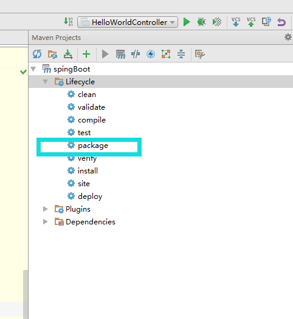

将这个应用打成jar包，直接使用 java -jar的命令进行执行【注意在打包成的jar包中，已经自带了tomcat的jar包，因此和你本地装没装tomcat没有关系】；得到目标jar包后，用java -jar 运行目标jar包，然后直接浏览器访问即可

具体参看[^1]

 [^1]：C:\shiro-liang-yi-gitlab\udan\spingBoot 的atguigu分支

图示如下：

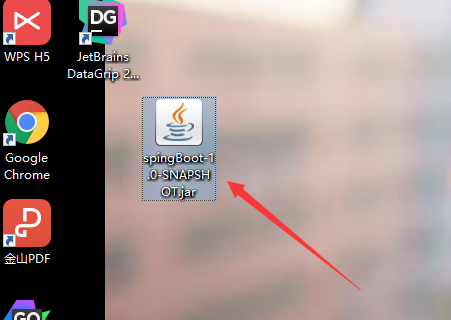

用war打开如下：

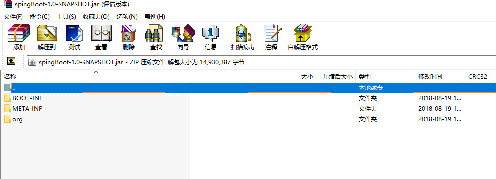

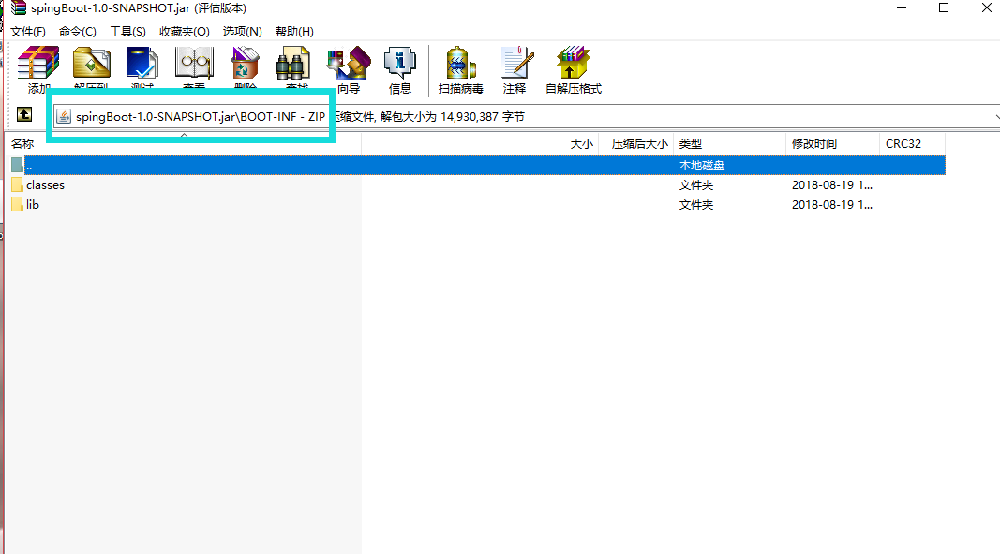

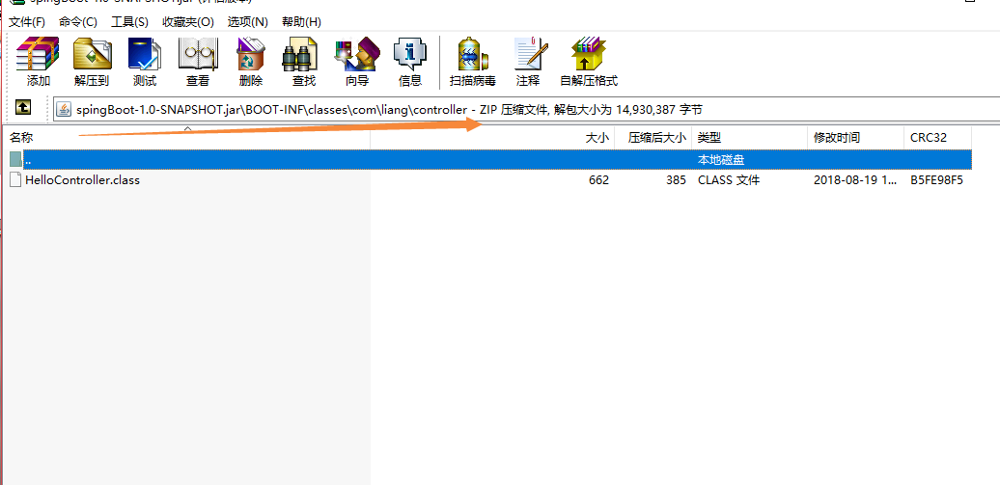

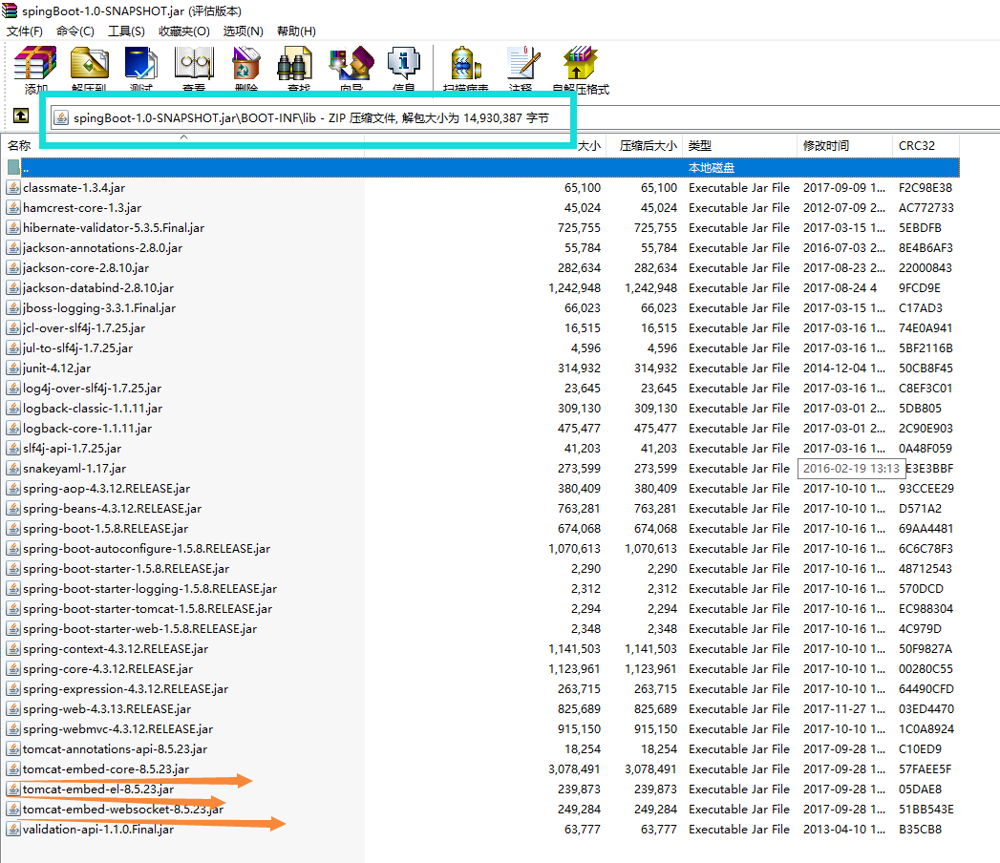

##### 5、Hello World探究

###### 1、POM文件

```xml
 <!--Spring Boot启动父依赖-->
<parent>
    <groupId>org.springframework.boot</groupId>
    <artifactId>spring-boot-starter-parent</artifactId>
    <version>1.5.8.RELEASE</version>
</parent>

它的父项目是
<parent>
		<groupId>org.springframework.boot</groupId>
		<artifactId>spring-boot-dependencies</artifactId>
		<version>1.5.8.RELEASE</version>
		<relativePath>../../spring-boot-dependencies</relativePath>
</parent>
它是来真正管理Spring Boot应用里面的所有依赖版本
```

Spring Boot的版本仲裁中心

以后我们导入依赖默认是不需要写版本的；因为所有的版本管理都在spring-boot-dependencies这个xml文件中进行了管理；但是也有一些是没有在spring-boot-dependencies中定义了的，那么就需要我们自己声明版本号的

###### 2、启动器

```xml
<dependency>
            <groupId>org.springframework.boot</groupId>
        	<artifactId>spring-boot-starter-web</artifactId>
</dependency>
```

**spring-boot-starter**-*web*

	spring-boot-starter：spring-boot场景启动器；帮我们导入了web模块正常运行所依赖的组件；

Spring Boot 将所有的功能场景都抽取出来，做成一个个的starter（启动器），只需要在项目里面引入这些starter相关场景的所有依赖都会导入进来，要用什么功能就导入什么场景的启动器

##### 6、使用Spring Initializr快速创建Spring Boot项目

IDE都支持使用Spring的项目创建向导快速创建一个Spring Boot项目

选择我们需要的模块，想到会联网创建模块

默认生成的Spring Boot项目：

 - 主程序已经生成好了，我们只需要我们自己的逻辑

 - resources文件夹中目录结构

    - static：保存所有的静态资源：js css images

    - templates：保存所有的模板页面（Spring Boot默认jar包使用嵌入式的tomcat，默认不支持JSP页面）；可以使用模板引擎（freemarker、thymeleaf）

    - application.properties：Spring Boot应用的配置文件：可以修改一些默认配置，比如启动端口，就在里面修改即可

      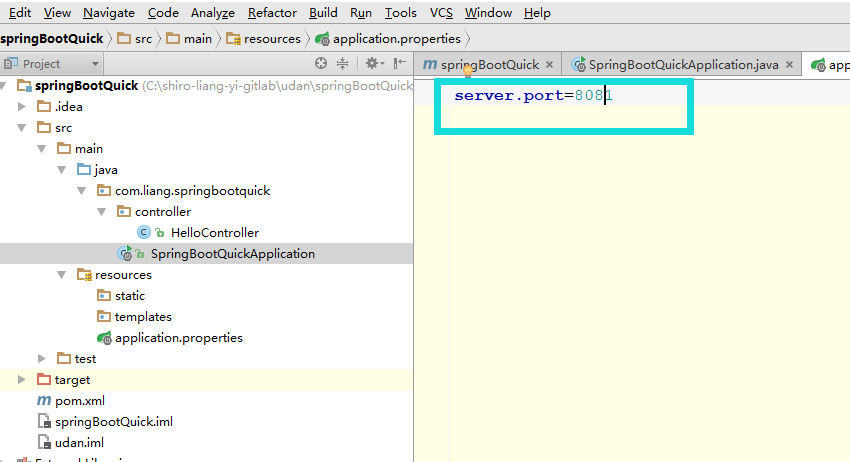

### 2018-08-20 08:58 星期一

### 2018-08-21 09:36 星期二

#### Linux运维命令

| 命令  | 功能说明                                                     |
| :--- | :----------------------------------------------------------- |
| man   | 查看命令帮助，命令的词典，更复杂的还有 info，但不常用。如：man cd |
| help  | 查看 Linux 内置命令的帮助，比如 cd 命令。 cd --help          |
| 文件和目录操作命令 (18 个) |  |
| ls    | 全拼list，功能是列出目录的内容及其内容属性信息    ls    -lah  \|  more |
| cd  | 全拼change directory，功能是从当前工作目录切换到指定的工作目录  cd  - |
| cp    | 全拼copy，其功能为复制文件或目录                             |
| find  | 查找的意思，用于查找目录及目录下的文件                       |
| mkdir | 全拼make directories，其功能室创建目录                       |
| mv    | 全拼 move，其功能是移动或重命名文件。                        |
| pwd   | 全拼 print working directory，其功能是显示当前工作目录的绝对路径。 |
| rename | 用于重命名文件。 |
| rm | 全拼 remove，其功能是删除一个或多个文件或目录。 |
| rmdir | 全拼 remove empty directories，功能是删除空目录。 |
| touch | 创建新的空文件，改变已有文件的时间戳属性。 |
| tree | 功能是以树形结构显示目录下的内容。 |
| basename | 显示文件名或目录名。 |
| dirname | 显示文件或目录路径。 |
| chattr | 改变文件的扩展属性。 |
| lsattr | 查看文件扩展属性。 |
| md5sum | 计算和校验文件的 MD5 值。 |
| file | 显示文件的类型。 |
| cat | 全拼 concatenate，功能是用于连接多个文件并且打印到屏幕输出或重定向到指定文件中。 |
| gedit | 也是编辑打开文件 |
| hostname | 显示或者设置当前系统的主机名。 |
| find ./ -name test.sh | 查找当前目录下所有名为test.sh的文件 |
| find ./ -name '*.sh' | 查找当前目录下所有后缀为.sh的文件 |
| find ./ -name "[A-Z]" | 查找当前目录下所有以大写字母开头的文件 |
| find /tmp -size 2M | 查找在/tmp目录下等于2M的文件 |
| find /tmp -size +2M | 查找在/tmp目录下大于2M的文件 |
| find ./  -size +4k  -size -5M | 查找当前目录下大于4K，小于5M的文件 |
| find ./  -perm 777 | 查找当前目录下 权限为777的文件或目录 |
|  |  |
|文件压缩及解压缩命令（4 个）||
|tar|打包压缩。oldboy|
|unzip|解压文件。|
|gzip|gzip 压缩工具。|
|zip|压缩工具。|
| 信息显示命令（11 个） |  |
| uname | 显示操作系统相关信息的命令。 |
| dmesg | 显示开机信息，用于诊断系统故障。 |
| uptime | 显示系统运行时间及负载。 |
| stat | 显示文件或文件系统的状态。 |
| top | 实时显示系统资源使用情况。 |
| free | 查看系统内存。 |
| date | 显示与设置系统时间。 |
| cal | 查看日历等时间信息。 |
| 搜索文件命令（4 个） |  |
| which | 查找二进制命令，按环境变量 PATH 路径查找。 |
| find | 从磁盘遍历查找文件或目录。 |
| whereis | 查找二进制命令，按环境变量 PATH 路径查找。 |
| locate | 从数据库 (/var/lib/mlocate/mlocate.db) 查找命令，使用 updatedb 更新库。 |
|用户管理命令||
| useradd | 添加用户。 |
| usermod | 修改系统已经存在的用户属性。 |
| userdel | 删除用户。 |
| passwd | 修改用户密码。 |
| groupadd | 添加用户组。 |
| chage | 修改用户密码有效期限。 |
| id | 查看用户的 uid,gid 及归属的用户组。 |
| su | 切换用户身份。 |
| visudo | 编辑 / etc/sudoers 文件的专属命令。 |
| sudo | 以另外一个用户身份（默认 root 用户）执行事先在 sudoers 文件允许的命令。 |
| 基础网络操作命令 |  |
| telnet | 使用 TELNET 协议远程登录。 |
| ssh | 使用 SSH 加密协议远程登录。 |
| scp | 全拼 secure copy，用于不同主机之间复制文件。 |
| wget | 命令行下载文件。 |
| ping | 测试主机之间网络的连通性。 |
| route | 显示和设置 linux 系统的路由表。 |
| ifconfig | 查看、配置、启用或禁用网络接口的命令。 |
| ifup | 启动网卡。 |
| ifdown | 关闭网卡。 |
| netstat | 查看网络状态。 |
| ss | 查看网络状态。 |
| 深入网络操作命令 |  |
| nmap | 网络扫描命令。 |
| lsof | 全名 list open files，也就是列举系统中已经被打开的文件。 |
| mail | 发送和接收邮件。 |
| mutt | 邮件管理命令。 |
| nslookup | 交互式查询互联网 DNS 服务器的命令。 |
| dig | 查找 DNS 解析过程。 |
| host | 查询 DNS 的命令。 |
| traceroute | 追踪数据传输路由状况。 |
| tcpdump | 命令行的抓包工具。 |
| 系统权限及用户授权相关命令 |  |
| chmod | 改变文件或目录权限。 |
| chown | 改变文件或目录的属主和属组。 |
| chgrp | 更改文件用户组。 |
| umask | 显示或设置权限掩码。 |
| 查看系统用户登陆信息的命令（7 个） |  |
| whoami | 显示当前有效的用户名称，相当于执行 id -un 命令。 |
| who | 显示目前登录系统的用户信息。 |
| w | 显示已经登陆系统的用户列表，并显示用户正在执行的指令。 |
| last | 显示登入系统的用户。 |
| lastlog | 显示系统中所有用户最近一次登录信息。 |
| users | 显示当前登录系统的所有用户的用户列表。 |
| finger | 查找并显示用户信息。 |
| 内置命令及其它（19 个） |  |
| echo | 打印变量，或直接输出指定的字符串 |
| printf | 将结果格式化输出到标准输出。 |
| rpm | 管理 rpm 包的命令。 |
| yum | 自动化简单化地管理 rpm 包的命令。 |
| watch | 周期性的执行给定的命令，并将命令的输出以全屏方式显示。 |
| alias | 设置系统别名。 |
| unalias | 取消系统别名。 |
| history | 查看命令执行的历史纪录。 |
| eject | 弹出光驱。 |
| nc | 功能强大的网络工具。 |
| time | 计算命令执行时间。 |
| xargs | 将标准输入转换成命令行参数。 |
| exec | 调用并执行指令的命令。 |
| export | 设置或者显示环境变量。 |
| bc | 命令行科学计算器 |
| 系统管理与性能监视命令 (9 个) |  |
| chkconfig | 管理 Linux 系统开机启动项。 |
| vmstat | 虚拟内存统计。 |
| mpstat | 显示各个可用 CPU 的状态统计。 |
|iostat|统计系统 IO。|
|sar|全面地获取系统的 CPU、运行队列、磁盘 I/O、分页（交换区）、内存、 CPU 中断和网络等性能数据。|
|ipcs|用于报告 Linux 中进程间通信设施的状态，显示的信息包括消息列表、共享内存和信号量的信息。|
|ipcrm|用来删除一个或更多的消息队列、信号量集或者共享内存标识。|
|strace|用于诊断、调试 Linux 用户空间跟踪器。我们用它来监控用户空间进程和内核的交互，比如系统调用、信号传递、进程状态变更等。|
|ltrace|命令会跟踪进程的库函数调用, 它会显现出哪个库函数被调用。|
|关机 / 重启 / 注销和查看系统信息的命令（6 个）||
|shutdown|关机。|
|halt|关机。|
|poweroff|关闭电源。|
|logout|退出当前登录的 Shell。|
|exit|退出当前登录的 Shell。|
|Ctrl+d|退出当前登录的 Shell 的快捷键。|
|进程管理相关命令（15 个）||
|bg|将一个在后台暂停的命令，变成继续执行  （在后台执行）。|
|fg|将后台中的命令调至前台继续运行。|
|jobs|查看当前有多少在后台运行的命令。|
|kill|终止进程。|
|killall|通过进程名终止进程。|
|pkill|通过进程名终止进程。|
|crontab|定时任务命令。|
|ps|显示进程的快照。|
|pstree|树形显示进程。|
|nice/renice|调整程序运行的优先级。|
|nohup|忽略挂起信号运行指定的命令。|
|pgrep|查找匹配条件的进程。|
|runlevel|查看系统当前运行级别。|
|init|切换运行级别。|
|service|启动、停止、重新启动和关闭系统服务，还可以显示所有系统服务的当前状态。|
|查看文件及内容处理命令（21 个）||
|cat|全拼 concatenate，功能是用于连接多个文件并且打印到屏幕输出或重定向到指定文件中。|
|tac|tac 是 cat 的反向拼写，因此命令的功能为反向显示文件内容。|
|more|分页显示文件内容。|
|less|分页显示文件内容，more 命令的相反用法。|
|head|显示文件内容的头部。|
|tail|显示文件内容的尾部。|
|cut|将文件的每一行按指定分隔符分割并输出。|
|split|分割文件为不同的小片段。|
|paste|按行合并文件内容。|
|sort|对文件的文本内容排序。|
|uniq|去除重复行。oldboy|
|wc|统计文件的行数、单词数或字节数。|
|iconv|转换文件的编码格式。|
|dos2unix|将 DOS 格式文件转换成 UNIX 格式。|
|diff|全拼 difference，比较文件的差异，常用于文本文件。|
|vimdiff|命令行可视化文件比较工具，常用于文本文件。|
|rev|反向输出文件内容。|
|grep/egrep|过滤字符串，三剑客老三。|
|join|按两个文件的相同字段合并。|
|tr|替换或删除字符。|
|vi/vim|命令行文本编辑器。|

### 2018-08-22 09:06 星期三

#### NodeJs去除所有空格

```
orderNo: _self.form.orderId.replace(/\s+/g, ''),
去除所有空格使用replace(/\s+/g, '')这个；
去除两端的空格使用trim()
```

### 2018-08-23 09:11 星期四

### 2018-08-24 13:20 星期五

```
https://github.com/TheTorProject/gettorbrowser
在github.com上staring的项目很不错
```

#### Scala之apply

其实一直听到apply方法，但是具体不知道是什么含义？

> 调用某个的对象的apply方法，其含义是，当我们在对一个类（比如Array时），我们往往是直接调用的如下代码  val array = Array("1","2","3")
>
> 这里其实就是一个apply，为什么这么说呢？因为我们都知道类是不能直接调用方法的（除非是像Java中的静态类），因此我们这里的Array就是调用了Array类的伴生对象（同名的Array）的里面的apply方法，这个伴生对象其实就是Java中的静态实例了，因为它不能再被实例化了

因此，以后再听见说是某某类的apply方法时，其实调用了它的伴生对象的apply方法，传入了指定的参数；

当然与之对偶的还有一个unapply方法，这个以后我理解后再记

#### Scala之List操作

```scala
package com.liang.scala

import java.util.Date
import java.text.SimpleDateFormat

/**
 * shiro.liang.yi@gmail.com
 * 18-08-24 21:05:34
 */
object List_self {
  
  
  def main(args: Array[String]){
    
		  println(List(1,2,3) :: List(4,5,6,7,8,9) :: List(10,11,12)) //List(List(1, 2, 3), List(4, 5, 6, 7, 8, 9), 10, 11, 12)
		  println((List(1,2,3)) ::: (List(4,5,6,7,8,9)) ::: (List(10,11,12))) //三个冒号直接操作的是List，两个冒号操作的是元素List(1, 2, 3, 4, 5, 6, 7, 8, 9, 10, 11, 12)
    
		  val bigData = List("NetBean","Intellij IDEA","Eclipse")
		  println(bigData.last)//Eclipse
		  println(bigData.init)//List(NetBean, Intellij IDEA)
		  println(bigData.reverse)//List(Eclipse, Intellij IDEA, NetBean)
		  println(bigData)//List(NetBean, Intellij IDEA, Eclipse)
		  println(bigData take 2) //‘take 2 ’操作是取出前两个元素 List(NetBean, Intellij IDEA)
		  println(bigData drop 2)//List(Eclipse)
		  println(bigData splitAt 2)//(List(NetBean, Intellij IDEA),List(Eclipse))
		  println(bigData apply 2)//Eclipse
		  println(bigData(2))//Eclipse
		  println()
		  
		  val data = List('a','b','c','d','e','f')
		  println(data.indices)//Range 0 until 6
		  println(data.indices zip data)//Vector((0,a), (1,b), (2,c), (3,d), (4,e), (5,f))
		  println(data.zipWithIndex)//List((a,0), (b,1), (c,2), (d,3), (e,4), (f,5))
		  println(data.toString())//List(a, b, c, d, e, f)
		  println(data.mkString("<", "*", ">"))//<a*b*c*d*e*f>
		  println(data.mkString("     "))//a     b     c     d     e     f
		  println(data.mkString)//abcdef
		  println()
		  
		  
		  val buffer = new StringBuilder
		  data addString(buffer, "(", ";;", ")")
		  println(buffer)//(a;;b;;c;;d;;e;;f)
		  println()
		  
		  val array = data.toArray
		  println(array.toList)//List(a, b, c, d, e, f)
		  println()
		  
		  val new_Array = new Array[Char](10)
		  data.copyToArray(new_Array,3)
		  new_Array.foreach(print)//   abcdef  前三个去掉
		  println()
		  
		  val iterator = data.toIterator
		  println(iterator.next)//a
		  println(iterator.next)//b
		  println(iterator.next())//c
		  
		  //Scala中调用当前系统时间  SimpleDateFormat这个类不是Scala包中的，因此没有可供直接使用的伴生对象apply方法，必须new
		  println(new SimpleDateFormat("yy-MM-dd HH:mm:ss").format(new Date()))
		  
		  
  }
}
```

```Scala
package com.liang.scala.list

import java.util.Date
import java.text.SimpleDateFormat

/**
 * shiro.liang.yi@gmail.com
 * 18-08-25 09:17:05
 */
object List_Highorder_Function_Ops {
  
  def main(args : Array[String]) : Unit = {
    
    /* 纯粹是为了熟悉Scala中的取出当前系统时间方法
    println(new SimpleDateFormat("YY-MM-dd HH:mm:ss").format(new Date()))*/
    
    /*map(_ + 1)的这种简写法,其实是map(i => i + 1)的简写*/
    println(List(1,2,3,4,6) map(_ + 1))//List(2, 3, 4, 5, 7)
    val data = List("Scala", "Hadoop", "Spark")
    /*其实最好不要调用length方法(效率太低)，判空时调用isEmpty要好点*/
    println(data map(_.length)) //List(5, 6, 5)
    /*mkString("","","")默认是三个参数的，但是你可以选择性的写*/
    println(data map(_.toList.reverse.mkString("","","")))//List(alacS, poodaH, krapS)
    println
    
    println(data.map(_.toList))//List(List(S, c, a, l, a), List(H, a, d, o, o, p), List(S, p, a, r, k))
    println(data.flatMap(_.toList))//List(S, c, a, l, a, H, a, d, o, o, p, S, p, a, r, k)
    println(List.range(1,10) flatMap(i => List.range(1,i) map(j => (i,j))))//List((2,1), (3,1), (3,2), (4,1), (4,2), (4,3), (5,1), (5,2), (5,3), (5,4), (6,1), (6,2), (6,3), (6,4), (6,5), (7,1), (7,2), (7,3), (7,4), (7,5), (7,6), (8,1), (8,2), (8,3), (8,4), (8,5), (8,6), (8,7), (9,1), (9,2), (9,3), (9,4), (9,5), (9,6), (9,7), (9,8))

    println    
    
    var sum = 0
    List(1,2,3,4,5) foreach(sum += _)
    println("sum: " + sum)//sum: 15
    println
    
    println(List(1,2,3,4,6,7,8,9,10) filter(_ % 2 == 0))//List(2, 4, 6, 8, 10)
    println(data filter(_.length == 5))//List(Scala, Spark)
      
    /*partition其实是分裂（即将List分成两部分的操作）*/
    println(List(1,2,3,4,5) partition(_ % 2 == 0))//(List(2, 4),List(1, 3, 5))
    println(List(1,2,3,4,5) find(_ % 2 == 0))//Some(2)
    println(List(1,2,3,4,5) takeWhile(_ < 4))//List(1, 2, 3)
    println(List(1,2,3,4,5) dropWhile(_ < 4))//List(4, 5)
    /*span()也是将元素分为两部分,但是List的partition是会遍历所有元素的;而span是碰到第一个不满足的元素即返回*/
    println(List(1,2,3,4,5) span(_ < 4))//(List(1, 2, 3),List(4, 5))
    println
    
    val left = List(1,2,3)
    val right = List(4,5,6)
    /*以下操作等价*/
    println(left ++ right)//List(1, 2, 3, 4, 5, 6)
    println(left ++: right)//List(1, 2, 3, 4, 5, 6)
    println(right.++:(left))//List(1, 2, 3, 4, 5, 6)
    println(right.:::(left))//List(1, 2, 3, 4, 5, 6)
    /*以下操作等价*/
    println(0 +: left)//List(0, 1, 2, 3)
    println(left.+:(0))//List(0, 1, 2, 3)
    println
    
    def hastotallyZeroRow(m : List[List[Int]]) = m exists(row => row forall(_ == 0))
    val m = List(List(1,0,0), List(0,1,0), List(0,0,0))
    println(hastotallyZeroRow(m))//true
    
  }
}
```

### 2018-08-27 09:13 星期一

#### Scala ::: and ++

With ':::'  you can only concatenate two List 

With '++' you can append any collection to List 

```scala
scala> List(1,2,3) ++ "ab"
res0: List[AnyVal] = List(1,2,3,a,b)
scala> List(1,2,3) + "ab"
res1: String = List(1,2,3)ab
```

#### Scala之入门

```scala
package com.liang.scala

/**
 * shiro.liang.yi@gmail.com
 * 18-08-27 21:44:13
 */
object ScalaBasics {
  
  def looper(x : Long,y : Long) : Long = {
    var a = x
    var b = y
    while(a != 0){
      val temp = a
      a = b % a
      b = temp
    }
    b
  }
  //println(looper(123,432))
    
  /**
   * 普通读取控制台输入方法
   */
  def doWhile(){
    var line = ""
      do{
        line = readLine()
        println("Read: " + line)
      }while(line != "")
  }
   //doWhile() //调用
   
   /**
    * 入口方法
    */
   def main(args: Array[String]): Unit = {
//    print("Spark is scala; hadoop is java")
//    for(arg <- args) println(arg)
     
     //流程判断
     var file = "scala.txt"
     if(!args.isEmpty) file = args.apply(0)
      // val file = if(!args.isEmpty) args(0) else "Spark.xml"
         //println(file)
        // println(if(!args.isEmpty) args(0) else "Spark.xml")
         
     //打印出当前目录下的所有子文件或文件夹
      /* val files = (new java.io.File(".")).listFiles()
       for(file <- files){
         println(file)
       }
     */
     
     
     //从控制台读取内容
     var line = ""
     do{
       println("please input some words blow......")
       line = readLine()
       println("Read: " + line)
     }while(line != "")
  }
   
  
}
```

#### Scala之Tuple

```scala
package com.liang.scala

/**
 * shiro.liang.yi@gmail.com
 * 18-08-27 21:44:13
 */
object TupleOps {
  
  def main(args: Array[String]) : Unit = {
    //这里scala能够推导出triple是一个Tuple
    //Tuple的声明就是直接一个圆括号
    val triple = (100,"Scala","Spark")
    println(triple._1)
    println(triple._2)
  }
}
```

#### Scala之基本集合类

##### List

```scala
//标准的LinkedList
scala> List(1,2,3)
res0: List[Int] = List(1,2,3)
//你也可以像在函数式语言里一样把它们串接起来
scala> 1 :: 2 :: 3 :: Nil
res1: List[Int] = List(1,2,3)
//参考API文档:https://www.scala-lang.org/api/current/scala/collection/immutable/List.html
```

##### Set

```scala
//Set里面不包含重复元素
scala> Set(1,1,2)
res2: scala.collection.immutable.Set[Int] = Set(1,2)
//参考API文档:https://www.scala-lang.org/api/current/scala/collection/immutable/Set.html
```

##### Seq

```scala
//Sequence都有一个预定义的顺序
scala> Seq(1,1,2)
res3: Seq[Int] = List(1,1,2)
/*注意返回的结果是一个List,Seq是一个trait;List是它的一个实现类.Seq对象是一个工厂对象,正如你所看到的,它会创建一个List*/    
//参考API文档:https://www.scala-lang.org/api/current/scala/collection/immutable/Seq.html
```

##### Map

```scala
//Map是保存键-值对的容器
scala> Map('a' -> 1, 'b' -> 2)
res4: scala.collection.immutable.Map[Char,Int] = Map((a,1), (b,2))
//参考API文档:https://www.scala-lang.org/api/current/scala/collection/immutable/Map.html
```

##### 层级关系

上面的这些都是trait，在可变（mutable）包和不可变（immutable）包里都有对应的实现，同时也有其它特殊用途的实现

##### Traversable

> 所有的集合都可遍历的。这个trait定义了标准函数组合器。这些组合器都是通过foreach这个方法来实现的，并且所有的集合都实现了这个方法 

##### Iterable

> 这个trait有一个`iterator()`方法，它返回一个可以遍历所有元素的Iterator 
>
> 参考API文档：https://www.scala-lang.org/api/current/scala/collection/Iterable.html

##### 和Java进行交互

> 你可以通过 [JavaConverters 包](http://www.scala-lang.org/api/current/index.html#scala.collection.JavaConverters$)在Java和Scala的集合类之间进行转换. 它给常用的Java集合提供了`asScala`方法，同时给常用的Scala集合提供了`asJava`方法 

```scala
import scala.collection.JavaConverters._
val sl = new scala.collection.mutable.ListBuffer[Int]
val jl : java.util.List[Int] = sl.asJava
val sl2 : scala.collection.mutable.Buffer[Int] = jl.asScala
assert(sl eq sl2)
```

双向转换

```scala
scala.collection.Iterable <=> java.lang.Iterable
scala.collection.Iterable <=> java.util.Collection
scala.collection.Iterator <=> java.util.{ Iterator, Enumeration }
scala.collection.mutable.Buffer <=> java.util.List
scala.collection.mutable.Set <=> java.util.Set
scala.collection.mutable.Map <=> java.util.{ Map, Dictionary }
scala.collection.mutable.ConcurrentMap <=> java.util.concurrent.ConcurrentMap
```

另外，下面还提供了一些单向的转换方法

```scala
scala.collection.Seq => java.util.List
scala.collection.mutable.Seq => java.util.List
scala.collection.Set => java.util.Set
scala.collection.Map => java.util.Map
//其实从这里可以看出：Scala中的Seq类似于Java中的List、其它的基本一样
```

#### Scala之Set和Map进阶操作

```scala
package com.liang.scala.map
import java.text.SimpleDateFormat
import java.util.Date
import scala.collection.immutable.TreeSet
import scala.collection.immutable.TreeMap

/**
 * shiro.liang.yi@gmail.com
 * 18-08-27 20:49:19
 */
object Set_Map {

  def main(args: Array[String]): Unit = {
    
    import scala.collection.mutable
    /*调用Set的empty生成空的Set【注意：因为是空的,所以必须指明类型/其它同理】*/
    val data = mutable.Set.empty[Int]
    data ++= List(1,2,3)
    data += 4
    data --= List(2,3)
    println(data)//Set(1, 4)
    data += 1
    println(data)//Set(1, 4)
    data.clear()
    println(data)//Set()
    println()
    
    val map = mutable.Map.empty[String,String]
    map.put("key", "Hadoop")//这两种赋值方式是一样的
    map("Scala") = "Spark"
    println(map)//Map(key -> Hadoop, Scala -> Spark)
    println(map("Scala"))//Spark
    println
    
    /*【Scala中关于TreeSet、TreeMap等带Tree的,都会默认实现排序功能】*/
    val treeSet = TreeSet(9,3,1,8,0,2,7,4,6,5)
    println(treeSet)//TreeSet(0, 1, 2, 3, 4, 5, 6, 7, 8, 9) 默认会排序好
    val treeSetForChar = TreeSet("Spark","Scala","Hadoop")
    println(treeSetForChar)//TreeSet(Hadoop, Scala, Spark)
    println
    
    val treeMap = TreeMap("Scala" -> "Spark", "Java" -> "Hadoop")
    println(treeMap)//Map(Java -> Hadoop, Scala -> Spark) //用key排序的
    

  }
}
```

#### Scala之IO操作

```scala
package com.liang.scala

import scala.io.Source

object FileOps {
  def main(args: Array[String]): Unit = {
    //读取一个目标位置文件的内容,一定要注意引入的是scala.io.Source这个包
    val file = Source.fromFile("E:\\tcp-async-log")
    for(line <- file.getLines())
      println(line)
      
    //也可以指定一个网址地址,调用的方法就变成了从URL了
      val file_web = Source.fromURL("http://blog.sina.com.cn/") 
      for(line <- file_web.getLines()) {
        println(line)
      }
  }
}
```

#### Scala之Array初识

````scala
package com.liang.scala

/**
 * shiro.liang.yi@gmail.com
 * 18-08-27 21:44:13
 */
object ArrayOps {
  
  def main(args: Array[String]): Unit = {
    val array = Array(1,2,3,4,5)
//    for(a <- array){
//      println(a)
//    }
    for(i <- 0 until array.length)
      println(array(i))
  }
}
````

#### Scala之Map初识

```scala
package com.liang.scala

/**
 * shiro.liang.yi@gmail.com
 * 18-08-27 21:44:13
 */
object MapOps {
  
  def main(args: Array[String]): Unit = {
    val ages = Map("siben"->"aa","age"->20)
//    for(age <- ages) println(age)
//    for(age <- ages.keys) println(age)
//    for(age <- ages.values) println(age)
//    for((k,v) <- ages) println("key: "+k,"value: "+v)
//      for((kk,vv) <- ages) println(kk,vv)
    for((_,vvv) <- ages) println("vvv: "+vvv)
    for((kkk,_) <- ages) println("kkk: "+kkk)
  }
}
```

#### Scala之对List伴生对象的操作

```scala
package com.liang.scala.list

import java.text.SimpleDateFormat
import java.util.Date

/**
 * shiro.liang.yi@gmail.com
 * 2018-08-27 19:38:05
 */
object List_obj {

  def main(args: Array[String]): Unit = {
    
    //回顾时间的操作
    //println(new SimpleDateFormat("yyyy-MM-dd HH:mm:ss").format(new Date()))
    
    /**
     * 主要是对List的伴生对象的操作
     */
    println(List.apply(1,2,3)) //List(1, 2, 3)
    println(List.range(2, 7))//List(2, 3, 4, 5, 6) 产生一个前闭后开的List
    println(List.range(2, 7, 2))//List(2, 4, 6) range(start,end,step)
    println
    
    val zipped = "abcde".toList.zip(List(1,2,3,4,5))
    println(zipped)//List((a,1), (b,2), (c,3), (d,4), (e,5))
    println(zipped.unzip)//就是对zip操作的逆向操作(List(a, b, c, d, e),List(1, 2, 3, 4, 5))
    
  }
  
}
```

### 2018-08-28 07:11 星期二

#### StackOverflow释疑

> 我的StackOverflow地址：https://stackoverflow.com/users/9826686/%E6%A2%81liang
>
> 账号：shiro.liang.yi@gmail.com
>
> 密码：通用

```scala
为什么List (1 , 2 , 3) :: List (4 , 5 , 7 , 8 , 9) :: List (10, 11 , 12) 的运算结果是List(List(1, 2, 3), List(4, 5, 6, 7, 8, 9), 10, 11, 12)；而不是List (1 , 2 , 3) :: List (4 , 5 , 7 , 8 , 9) :: List (10, 11 , 12)这个呢？求解???
引用回答：
The "cons" method :: is for adding a new element to the head of a List.【注意这句话，cons的操作是添加一个新元素到a的头部】

val pet = 'c' :: List('a', 't')  //pet: List[Char] = List(c, a, t)
So what happens when you do this: List(4,5,7,8,9) :: List(10,11,12)? You are adding one new element of type List[Int] to a list of Ints. The result is a list with four elements: List[Int],Int,Int,Int. Since types Int and List[Int] are unrelated, the result is type List[Any].

val bad = List(4,5,7,8,9) :: List(10,11,12)
//bad: List[Any] = List(List(4, 5, 7, 8, 9), 10, 11, 12)
Extrapolate to one more List[Int] element and you can see why it returns the result you're getting.

val notGood = List(1,2,3) :: List(4,5,7,8,9) :: List(10,11,12)
//notGood: List[Any] = List(List(1, 2, 3), List(4, 5, 7, 8, 9), 10, 11, 12)

//到此，这个问题就解决了，可以看出确实很不错
var a = List(8,9,10) :: List(4,5,6) :: List(1,2,3)
println(a) //这样的结果是在List(1,2,3)的 ‘1’前面添加了两个List元素，由于List[Int]与Int类型并不相关，因此返回的是一个List[Any]
```

### 2018-08-29 07:04 星期三

#### Python

#### 常见linux命令

| 命令 | 功能         | 用法                     |
| ---- | ------------ | ------------------------ |
| cal  | 查看当前日历 | cal 、cal -y 2018、 date、date "+%y、%m、%d" > >1.txt |
| ps | 查看进程【默认显示的是当前终端下 的进程，如果想查看该服务器上所有的进程用：ps -aux】 | ps、ps   -aux、 |
| htop | 后台进程的实时刷新显示 | htop、top |
| kill | 杀死进程 | kill  对应进程的pId  、 kill  -9  pId【强制杀死】 |
| reboot | 重新启动操作系统 |  |
| shutdown -r now | 重新启动操作系统，shutdown会给别的用户提示 |  |
| shutdown -h 20:25 | 系统在今天的20:25会关机 |  |
| shutdown -h  now | 立刻关机，其中now相当于时间为0的状态 |  |
| shutdown -h +10 | 系统再过十分钟后自动关机 |  |
| init  0 | 关机 |  |
| init  6 | 重启 |  |
| df | 磁盘使用情况 | df  、  df  -h |
| du | 当前所在的文件夹所占用的空间大小 | du、du  -h |
| ifconfig | 查看网络地址 | 【注意与windows不一样ipconfig】 |
| ping | 测试网络连通性 | ping |
| whoami | 查看当前用户 |  |
| ctrl + shift + t | 打开多个操作页面 | 不用打开多个终端 |
| useradd  -m  aaa | 创建用户，带参数m表示自动在/home/目录下创建组 |  |
| who | 显示当前有哪些终端登录这台设备 |  |
| sudo | 当前用户不变，但是是以sudo超级管理员的身份去执行的；新创建的用户，默认不能sudo，需要进行下一步操作：sudo  usermod  -a -G adm 用户名；sudo usermod -a  -G sudo 用户名【这两步操作都需要执行】 |  |
| chmod | 总共十位数，去掉第一位（区分文件和文件夹），剩余九位每三位一组，第一组表示文件拥有着、第二组表示同组、第三组表示others | 修改一个文件（以2.py为例）的拥有着的权限：chmod u=rwx 2.py；chmod u=r,g=r,o=r 2.py |
|  | |  |

#### Vim 常用基本命令

| 命令                     | 用法                       | 说明                                                         |
| ------------------------ | -------------------------- | ------------------------------------------------------------ |
| 进入编辑模式             | i、a、o、I、A、O、Insert键 | i光标左侧插入、a光标右侧插入、o（小写）光标下一行插入、I（大写的i）光标所在行的行首插入、A光标所在行的行末插入、O光标所在行的上一行插入 |
| yy                       | 复制光标所在的行           | 都是在命令模式下；                                           |
| p                        | 粘粘                       | 都是在命令模式下                                             |
| 4yy                      | 一次性赋值多行             | 复制光标所在行开始向下的4行                                  |
| dd                       | 剪切（不粘贴即是删除）     | 删除光标所在的这一行                                         |
| 2dd                      | 一次性剪切多行             | 删除光标所在行  向下  2行（包含光标这一行）                  |
| D                        |                            | 从当前的光标处开始剪切，一直到行末                           |
| d0                       |                            | 从当前的光标处开始剪切，一直到行首                           |
| dw | | 删除光标开始位置的一个单词 |
| x                        |                            | 删除当前的光标后面，每次只会删除一个                         |
| X                        |                            | 删除当前光标前面的那个，每次只会删除一个                     |
| 控制做移动方向           |                            | h左、j下、k上、l右                                           |
| 在当前屏幕中空值光标移动 |                            | H：当前屏幕的上方、M：当前屏幕的中间、L：当前屏幕的下方      |
| ctrl+f                   | 向下翻一页代码             | ctrl+d：向下翻半页代码                                       |
| ctrl+b                   | 向上翻一页代码             | ctrl+u：向上翻半页代码                                       |
| 20G                      | 位置移动                   | 快速的定位到第20行代码、G：快速的回到整个代码的最后一行、 gg：快速的回到整个代码的第一行 |
| w（小写）                | 位置移动                   | 向后跳一个单词的长度，即跳到下一个单词的开始处               |
| b                        | 位置移动                   | 向前一个单词的长度，即跳到上一个单词的开始处                 |
| u                        | 撤销                       | 撤销刚刚的操作噢                                             |
| ctrl+r                   | 反撤销                     | 回到撤销操作前的状态                                         |
| v                        | 选中一片代码（到光标处）   |                                                              |
| V                        | 选中一片代码（整行整行的） |                                                              |
| >>                       | 向右移动代码               |                                                              |
| << | 向左移动代码 |                                                              |
| . | 重复执行上一次的命令 |                                                              |
|{||按段移动，上移|
|}||按段移动，下移|
|r|替换|替换一个字符|
|R|替换|替换光标以及后面的字符|
|/|搜索|/hello：搜索hello、要跳到下一个的搜索结果处，用n、跳到上一个搜索结果处用N|
|%s///g|全局替换|%s/将要替换掉的字符/替换成的字符/g;如：%s/hello/world/g  :就将所有的hello替换为了world|
||部分替换|如只想替换掉11到16行的所有的hello为world：11,16s/hello/world/g|
|w|保存||
|q|退出||
|wq|保存退出||
|shift+zz|相当于wq||

### 2018-08-30 06:45 星期四

#### shell脚本

> 啥叫shell脚本呢？其实就是一个批处理文件，里面谢了许多的命令，只需要运行这个文件，就相当于一次执行了许多命令
>
> shell脚本的后缀名是   .sh

第一种方式：


```shell
#如下写一个简单的shell脚本例子
ls
pwd 
ls -lah  /bin
```

然后将这个文件命名为:  test.sh

然后给它修改权限： chmod u=x test.sh

然后在linux上，执行:    ./test.sh即可

一般我们约定凡是自定义的脚本建议放到  /usr/local/sbin/  目录下，这样做的目的是：一来可以更好地管理文档、二来以后接管你的管理员都知道自定义的脚本放在那里，方便维护

第二种方式：

```shell
#! /bin/bash
# #!是表示该文件使用是bash语法，如果不设置该行，那么你的shell脚本就不能被执行；#表示注释
```

```shell
#! /bin/bash
date
echo "shiro.liang.yi@gmail.com"
```

然后将该文件命名为 test.sh【通常是以sh作为后缀的，只是习惯而已，没有sh也可以执行】

然后这样运行：

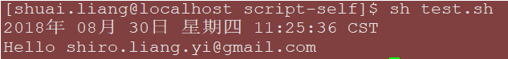

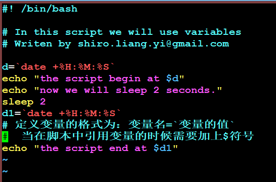

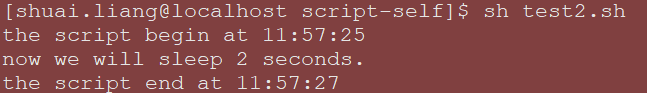

##### 逻辑判断

###### 1）不带else

```shell
if 判断语句；then
command
fi
```

在 if1.sh中出现了 ((a<60))这样的形式，这是shell脚本中特有的格式，用一个小括号或者不用都会报错，请记住这个格式即可

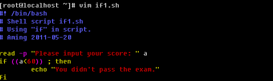

###### 2）带有else

```shell
if 判断语句；then
command
else
command
fi
```
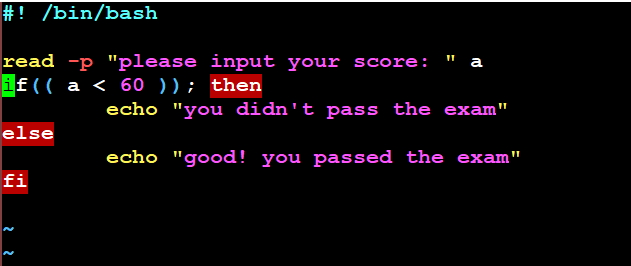
###### 3）带有elif

```shell
if 判断语句一；then
command
elif 判断语句二；then
command
else
command
fi
```

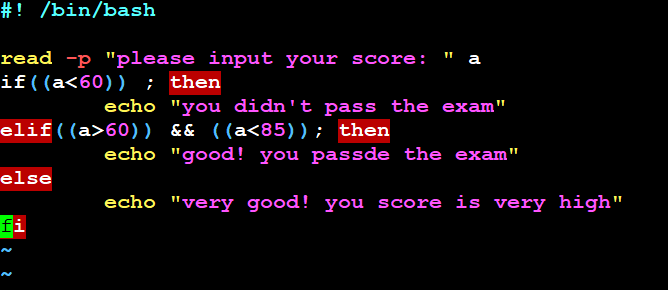

> 这里的 && 表示且的意思，当然你也可以使用 || 表示或者

> 以上只是简单的介绍了if语句的结构，在判断数值大小除了可以用“（()）”的形式外，还可以用“[]”。但是就不能使用 >、<、=这样的符号了，要使用 -lt（小于）、-gt（大于）、-le（小于等于）、-ge（大于等于）、-eg（等于）、-ne（不等于）

###### 4)case

> 在shell脚本中，除了if用来判断逻辑外，还有一种常用的方式就是case了，具体格式为；
>
> case 变量  in
>
> value 1)
>
> command
>
> ;;
>
> value 2)
>
> command
>
> ;;
>
> value 3)
>
> command
>
> ;;
>
> *)
>
> command
>
> ;;
>
> esac

上面的结构中，不限制value的个数，*则代表除了上面的value外的其它信息，下面写一个判断输入数值是奇数或者偶数的脚本：

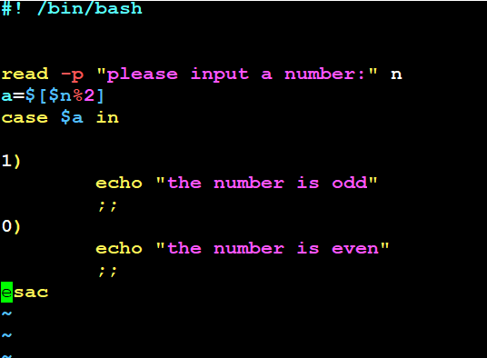

##### 循环

###### for循环

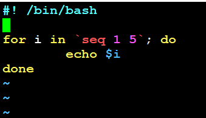

执行结果如下：

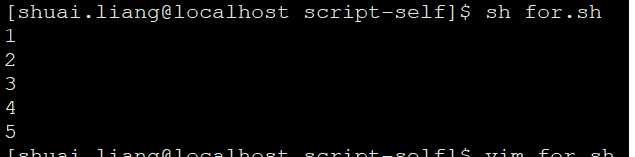

> 通过这个脚本就可以看到for循环的基本结构：
>
> for 变量名 in 循环的条件; do
>
> command
>
> done

也可以直接在命令行这样写：

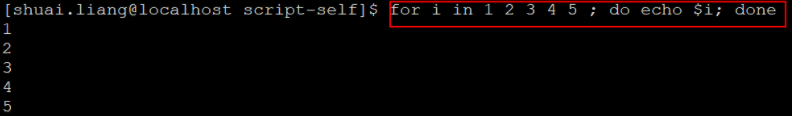

###### while循环

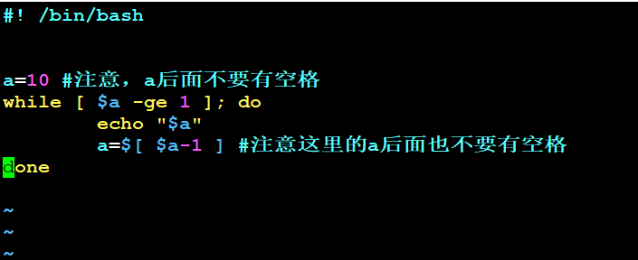

> while循环基本格式；
>
> while 条件; do
>
> command
>
> done

脚本的执行结果为；

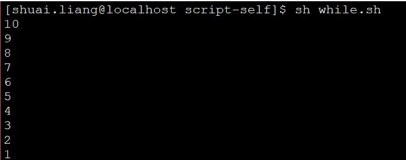

>另外你也可以把循环条件忽略掉，这样写
>
>while  :; do
>
>command
>
>done

##### 函数

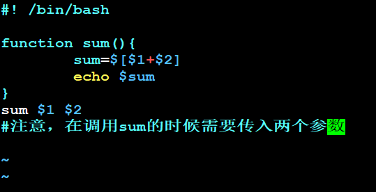

>这个脚本的执行过程需要注意：
>
>必须传入两个参数
>
>有一点需要注意，在shell脚本中，函数一定要写在最前面，不能出现在中间或者最后，因为函数是要被调用的，如果还没有出现就被调用，肯定是会出错的

运行方法如下：

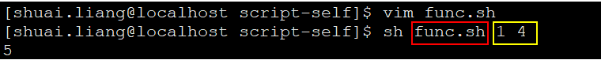

#### Python初识

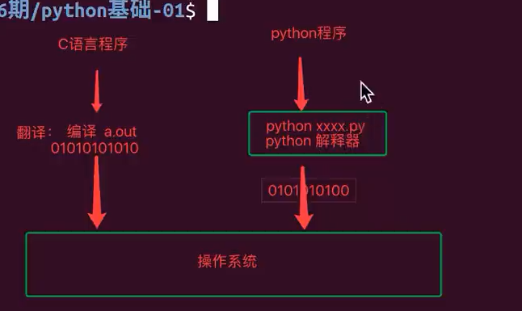

### 2018-08-31 06:50 星期五

#### python的类型

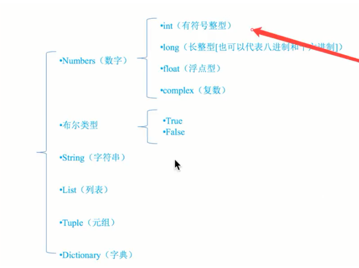

#### python数据类型转换

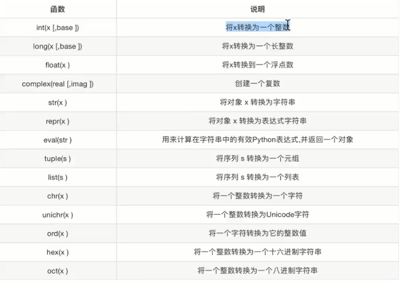

#### python标识符规则

* 标识符由字母、下划线和数字组成，且数字不能开头

#### python的if

```python
#! -*- coding=utf-8 -*-

name = input("请输入名字： ")
QQ = input("请输入QQ：")

# %s是占位符
print("name: %s"%name)
print("QQ: %s"%QQ)

```

```python
#!coding=utf-8

# age = 19
#
# if age>18:
#     print("gogogo")


#这种是错误的
# age = input("请输入age： ")
# if age>18 :
#     print("可以看h片了。。。 ")


age = input("请输入age： ")#input获取的所有数据默认都当做是字符串类型的
print(type(age))#查看某个变量的类型
#第一种解决办法：将age转成整型
age_num = int(age)

if age_num>18 :
    print("可以看h片了。。。 ")
else:
    print("只能偷偷看了")

```

#### python的input

```python
#! -*- coding=utf--8 -*-


age = 19
if age>13 :
    print("0")
    print("1")
    print("0")
    print("0")
    print("0")
    print("0")
    print("9")
print("*******") #在python中，缩进很重要，直接影响到程序的执行

```

* input一次输出多个值

```python
  #! coding=utf-8

name = "shiro.liang.yi@gmail.com"
age = 13
addr = "乌克兰"
#如果想输出多个值，在后面需要输出的整体前用'()'括起来，并加一个%
print("姓名是：%s,年龄是：%d,地址是：%s"%(name,age,addr))
```


#### python的print输出中有哪些占位符呢

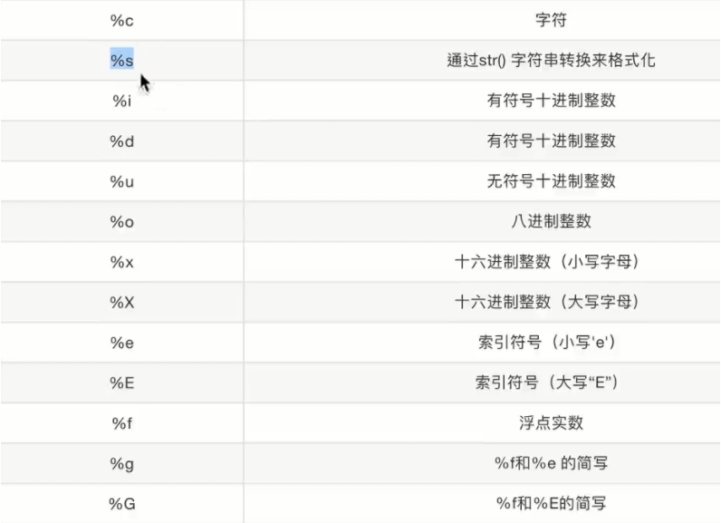

### 2018-09-01 06:56 星期六

#### python逻辑运算

```python
#! coding=utf-8

a = input("请输入一个数： ")
b = input("请再输入一个数： ")

if int(a)>43 and int(b)>3:  #注意if和elif的顺序，小范围的在前面
    print("两个数都大于3")
elif int(a)>3 or int(b)>3:
    print("至少有一个大于3")
else:
    print("傻子莫不过你")
```

#### python之while

```python
#! -*- coding=utf-8 -*-

# 打印1到10
num = 1
while num <= 10: # 这里没有圆括号，还有注释符号与内容之间空一格，其实python中的好多都没有圆括号，像if、while等
    print(num) # 真正的写法是 print("%d",%num)
    num += 1
```

#### python之复合运算符

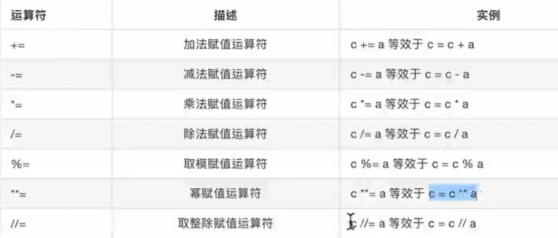

### 2018-09-03 07:00 星期一

#### python之for循环

```python
#! coding=utf-8


i = "123445609"

'''
for循环关键点：for、迭代变量、in关键字、迭代集合
'''

for a in i:
    print(a,end=" ")
```

```python
#! -*- coding=utf-8 -*-

#打印1到100之间的偶数

i = 1
while i <= 100:
    if i%2 == 0:
        print(i)
    i += 1
```

#### WireShark过滤表达式

> ip.dst == 10.0.0.230 and tcp  and !mysql and !http

#### Scala中的String格式转换

```scala
/*
我有一个类似这样的字符串“232302001A710218641004529”；
现在我想将它转化为这种形式：'23,23,02,00,1A'等这种形式，怎么做？
*/

//第一种方式
val str = "232302001A710218641004529" +
    "8B9A000A00000E100010160120903130108920050433630315F433133302E3030342E31" +
    "32372E30315F54312E312E300000006466626635613532613761346463303963343065" +
    "0000000000000000000000000000000000000000000001005D28"

  val ans = str.sliding(2,2).toList
  println(ans)
//List(23, 23, 02, 00, 1A, 71, 02, 18, 64, 10, 04, 52, 98, B9, A0, 00, A0, 00, 00, E1, 00, 01, 01, 60, 12, 09, 03, 13, 01, 08, 92, 00, 50, 43, 36, 30, 31, 5F, 43, 31, 33, 30, 2E, 30, 30, 34, 2E, 31, 32, 37, 2E, 30, 31, 5F, 54, 31, 2E, 31, 2E, 30, 00, 00, 00, 64, 66, 62, 66, 35, 61, 35, 32, 61, 37, 61, 34, 64, 63, 30, 39, 63, 34, 30, 65, 00, 00, 00, 00, 00, 00, 00, 00, 00, 00, 00, 00, 00, 00, 00, 00, 00, 00, 00, 00, 00, 00, 01, 00, 5D, 28)

//第二种方式
val string = "232302001A710218641004529"
val res = string.grouped(2).toList
println(res)   //List(23, 23, 02, 00, 1A, 71, 02, 18, 64, 10, 04, 52, 9)

//ps一定要多用，多练习，多看源码(这个是提高你的能力的捷径；多去StackOverflow上问大神，这是对于你解决问题的很重要的一个途径)
```

#### Markdown插入视频
<iframe width="560" height="315" src="./images/trailer.mp4" frameborder="0" allowfullscreen>
</iframe>

### 2018-09-04 09:13 星期二

#### git pull远程特定分支

> git pull origin  【远程你想拉取的分支】 :   【拉取到本地哪个分支】
>
> eg:    git  pull origin master : master

#### python切片、字符串逆序

```python
#! coding=utf-8


'''
切片、字符串逆序
'''

name = "abcdefABCDEF"

# 现在我想取出第2位到第6位，怎么做？【注意python是前闭后开的，想取到第6位，那么必须往后移一位】
print(name[2:7]) #cdefA
'''
想取出从第二位开始到倒数第二位，如下两种方式:一种从后面开始计数的下标是从 -1 开始的
'''
print(name[2:(len(name)-1)]) #cdefABCDE
print(name[2:-1]) #cdefABCDE
'''
不写后面的下标，默认是取到结束
'''
print(name[2:]) #cdefABCDEF
'''
现在我想从第二位开始取到倒数第二位；并且是隔两个两个的取(实际上就是步长step)
'''
print(name[2:-1:2]) #ceACE

'''
我现在想取它的逆序
'''
print(name[-1::-1]) #FEDCBAfedcba   #step取-1就是从后往前走
print(name[-1:0:-1]) #FEDCBAfedcb
```

#### python 常见字符串操作

```python
#! coding=utf-8

"""
字符串常见操作
"""

myStr = "hello shiro.liang.yi@gmail.com shiro.liang shiro"
'''
找到目标字符串初次出现的下标
'''
print(myStr.find("shiro.liang")) #6
print(myStr.find("&*")) # -1 #如果没有找到，返回-1
print()

'''
index 和 find 基本一样，只是在处理不存在的字符串时，结果不一样
'''
print(myStr.index("shiro.liang")) #6
#print(myStr.index("&*")) #ValueError: substring not found
print()

'''
返回目标字符串的出现次数
'''
print(myStr.count("shiro.liang")) #2
print()

'''
replace()：三个参；第一个想要被替换的字符串、第二个替换的字符串、第三个想要在目标字符串中替换多少个(不写，默认全替换)
'''
print(myStr.replace("liang","LIANG")) #hello shiro.LIANG.yi@gmail.com shiro.LIANG shiro
print(myStr) #hello shiro.liang.yi@gmail.com shiro.liang shiro #此时，并不影响本身字符串
print(myStr.replace("liang","LIANG",1)) #hello shiro.LIANG.yi@gmail.com shiro.liang shiro
print()

'''
split():分隔，参数是：以某个字符串来切割，比如第一个是以空格切割(即去掉了原来目标字符串的空格)；第二个以i来切割【注意，返回的是一个列表】
'''
print(myStr.split(" ")) #['hello', 'shiro.liang.yi@gmail.com', 'shiro.liang', 'shiro']
print(myStr.split("i")) #['hello sh', 'ro.l', 'ang.y', '@gma', 'l.com sh', 'ro.l', 'ang sh', 'ro']
print()

''' 
capitalize():是将首字母大写
title():是将每个字母的首字母都大写
'''
print(myStr.capitalize()) #Hello shiro.liang.yi@gmail.com shiro.liang shiro
print(myStr.title()) #Hello Shiro.Liang.Yi@Gmail.Com Shiro.Liang Shiro
print()

'''
startswith()检查字符串是否是以某个字符串开头，返回boolean
'''
print(myStr.startswith("hell")) #True
print(myStr.startswith("hello")) #True
print()

'''
endswith(obj)检查字符串是否是以obj结束【可以判断文件后缀名哦】
'''
print(myStr.endswith(".")) #False
print()

'''

'''
print(myStr)
 


```

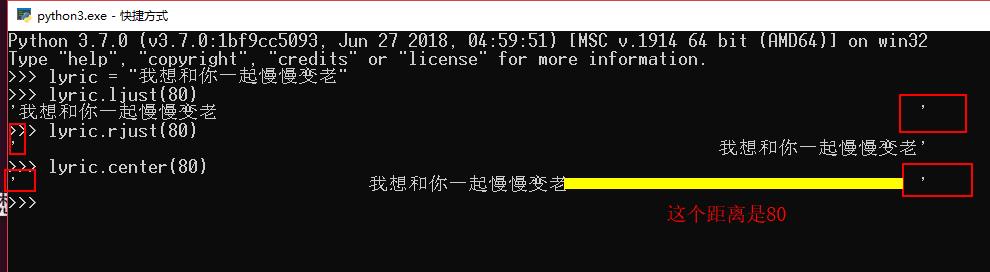

### 2018-09-05 07:06 星期三


